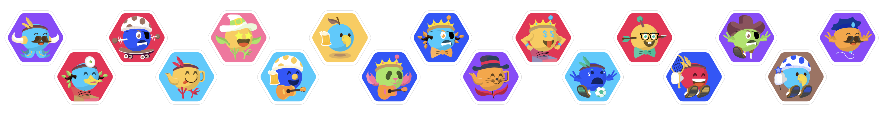

# Identicon



***

[](https://deploy.now.sh/?repo=https://github.com/LIU9293/identicon)

[Identicon](https://en.wikipedia.org/wiki/Identicon) is a unique image used to represent a string of text or something hard to remember. Use this can help your users quickly identify their different wallet addresses / mobile numbers / unique ID or anything hard to remeber

## Use free service by nimiqscan

The most simple way to use this is just:

```

```

## Build you own server

```
git clone
yarn / npm install
yarn start / npm start

// localhost:8080/your_awesome_icon
```

## Credit

[Nimiq](https://nimiq.com) is the original creator behind this project, [we](https://nimiqscan.com) made some color refinement on it.